# chap0x01 基于virtualBox的网络攻防搭建

## 实验目的

- 掌握 VirtualBox 虚拟机的安装与使用；
- 掌握 VirtualBox 的虚拟网络类型和按需配置；
- 掌握 VirtualBox 的虚拟硬盘多重加载；

## 实验环境

以下是本次实验需要使用的网络节点说明和主要软件举例：

- VirtualBox 虚拟机
- 攻击者主机（Attacker）：Kali Rolling 2109.2
- 网关（Gateway, GW）：Debian Buster
- 靶机（Victim）：From Sqli to shell / xp-sp3 / Kali

## 实验要求

* 虚拟硬盘配置成多重加载

* 搭建满足条件的网络拓扑
* 网络连通性测试
  - [x] 靶机可以直接访问攻击者主机
  - [x] 攻击者主机无法直接访问靶机
  - [x] 网关可以直接访问攻击者主机和靶机
  - [x] 靶机的所有对外上下行流量必须经过网关
  - [x] 所有节点均可以访问互联网

## 实验过程

* 将虚拟硬盘配置成多重加载
  * 选择要配置的虚拟机（已关闭）->删除备份
  
  * 点击 管理->虚拟介质管理->选中需要设置的vdi->在属性栏选择 类型->多重加载
  
  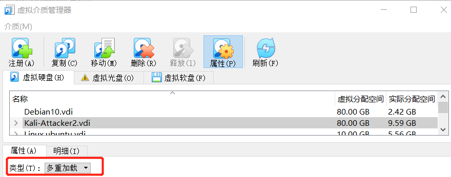
  
  * 选择虚拟机->设置->存储->重新挂载设置好的虚拟硬盘
  
    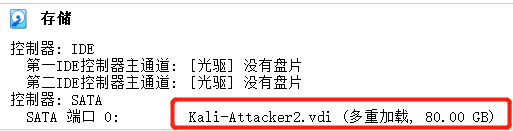
  
* 配置网卡搭建网络拓扑
  * 攻击者主机（Kali-Attacker2）
    
    * 网卡1：Intel PRO/1000 MT 桌面 （NAT 网络，'NatNetwork'）
    
    * 网卡2：Intel PRO/1000 MT 桌面（仅主机(Host-Only)网络，'VirtualBox Host-Only Ethernet Adapter #2'）
  
    * 网卡3：Intel PRO/1000 MT 桌面（仅主机(Host-Only)网络，'VirtualBox Host-Only Ethernet Adapter #2'）
    
      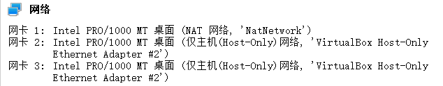
    
  * 网关（Debian1）
    
    * 网卡1：Intel PRO/1000 MT 桌面（NAT网络，'NatNetwork'）
    
    * 网卡2：Intel PRO/1000 MT 桌面（仅主机(Host-Only)网络，'VirtualBox Host-Only Ethernet Adapter #2'）
    
    * 网卡3：Intel PRO/1000 MT 桌面（内部网络，'intnet1'）
    
    * 网卡4：Intel PRO/1000 MT 桌面（内部网络，'intnet2'）
    
      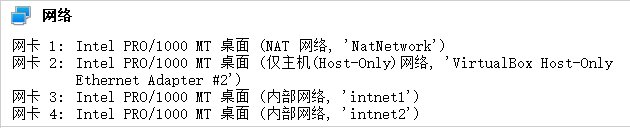
    
  * 靶机（xp-victim-2）
  
    * 网卡1：PCnet-FAST III（内部网络，‘intnet2’） 
  
      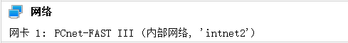
    
  * 网络拓扑图
    
    
  
* 连通性检测
  
  * 靶机---->攻击者主机，由下图可以到靶机Ping通了攻击者主机，收到了源ip为10.0.2.5的reply
  
    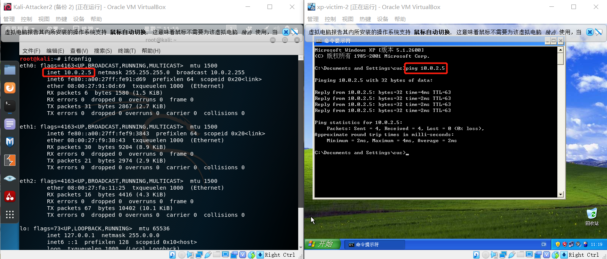
  
  * 攻击者主机--->靶机
  
    这里为了排除由于Windows防火墙因素造成Ping不同的可能，关闭了防火墙功能，攻击者依旧无法访问靶机。
  
    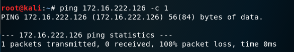
  
  * 网关<--->靶机和攻击者主机
  
    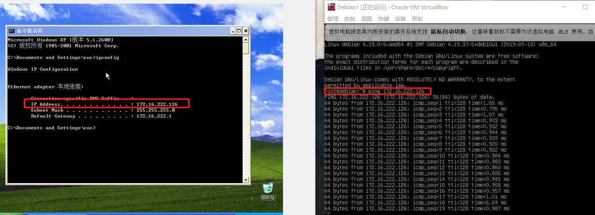
  
    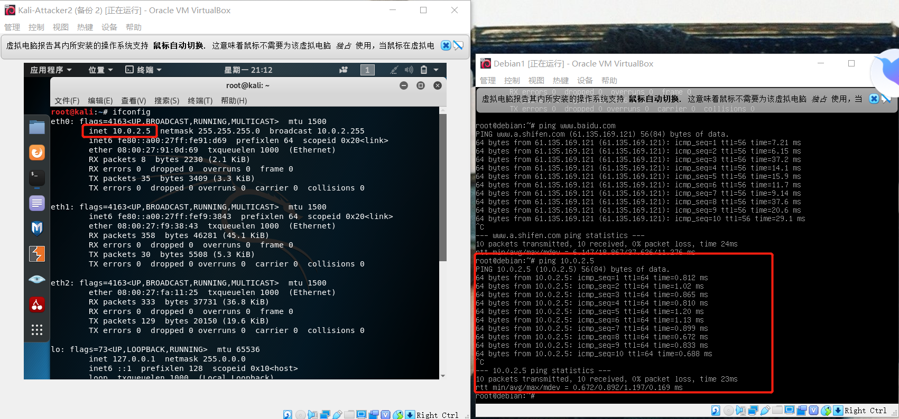
  
    
  
  * 靶机的所有上下行流量必须经过网关
  
    在Gateway开启抓包后靶机Ping百度，再次之前应清空靶机中的ARP缓存，通过 arp -a 可以查看本机的ARP高速缓存列表。在网关抓包列表中我们可以看到只会在局域网中发生的ARP请求，而且找Gateway的地址恰好是我们自己，ARP请求和DNS请求都经过我们，故靶机的所有上下行流量都经过网关。
  
    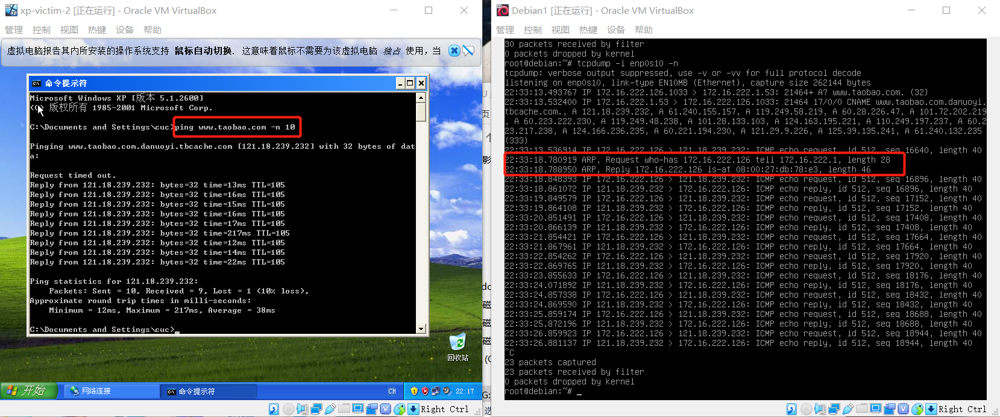
  
  * 所有节点均可上网
  
    - [x] 靶机Ping微博 
  
      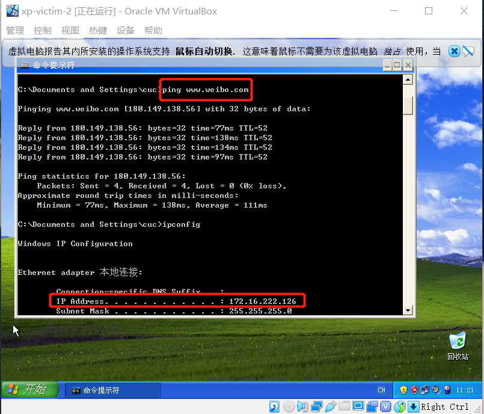
  
    - [x] 网关Ping 百度 
  
      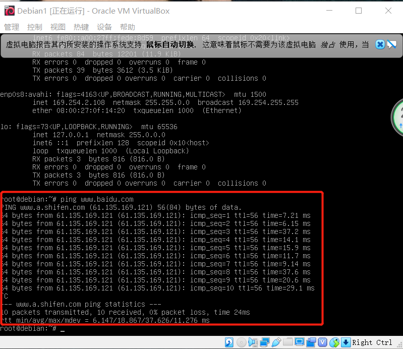
  
    - [x] 攻击者主机Ping百度 
  
      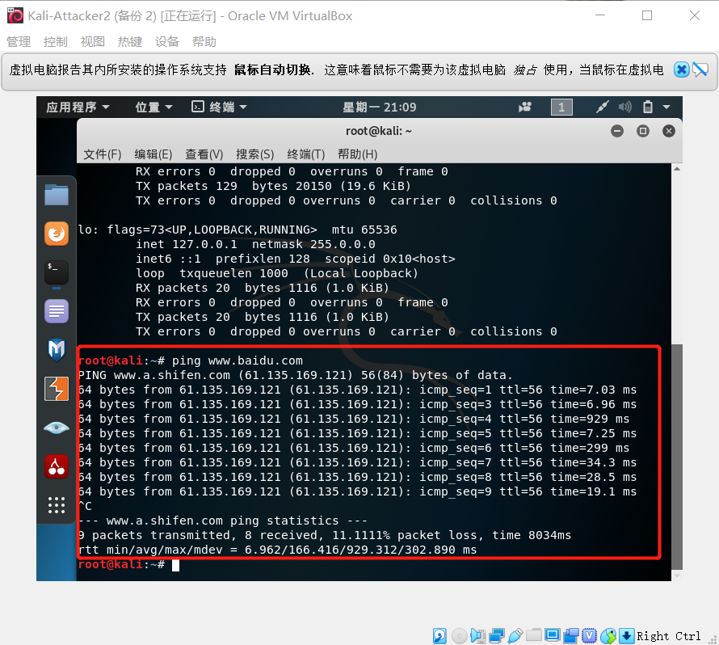

## 实验心得

* 遇到的问题

1. 如果虚拟机存在备份，则不能成功将虚拟硬盘设置为多重加载。

2. Kali-Attacker无法上网,打开终端，将以下命令复制到终端运行。

   >  grep "iface eth1 inet dhcp" /etc/network/interfaces || cat << EOF >> /etc/network/interfaces
   >
   > auto eth0
   > iface eth0 inet dhcp
   > auto eth1
   > iface eth1 inet dhcp
   > EOF

* 参考资料

  []: https://blog.csdn.net/nanyun2010/article/details/23445223	"tcpdump非常实用的抓包实例"
  []: https://blog.csdn.net/qq_35694099/article/details/80469615	"PING、ARP -a、ipconfig等网络测试命令的具体使用"
  []: https://blog.csdn.net/jeanphorn/article/details/45056251	"Virtualbox 多重加载 高级功能介绍"

  
